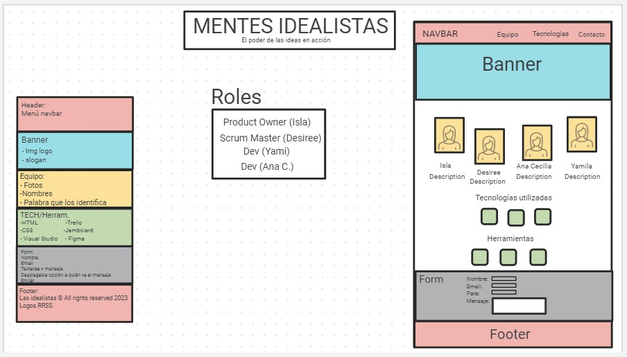
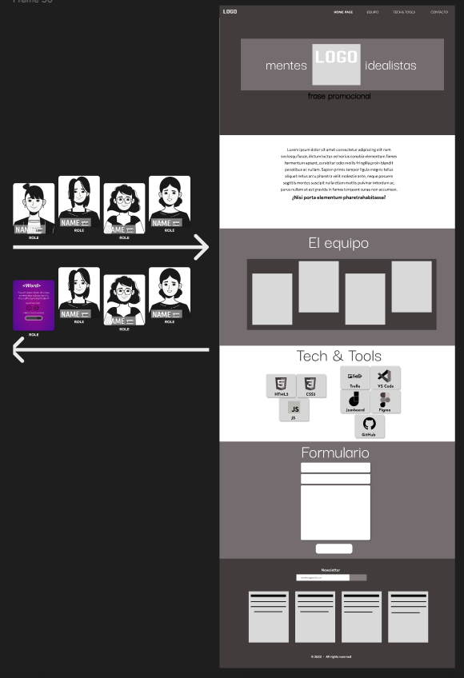
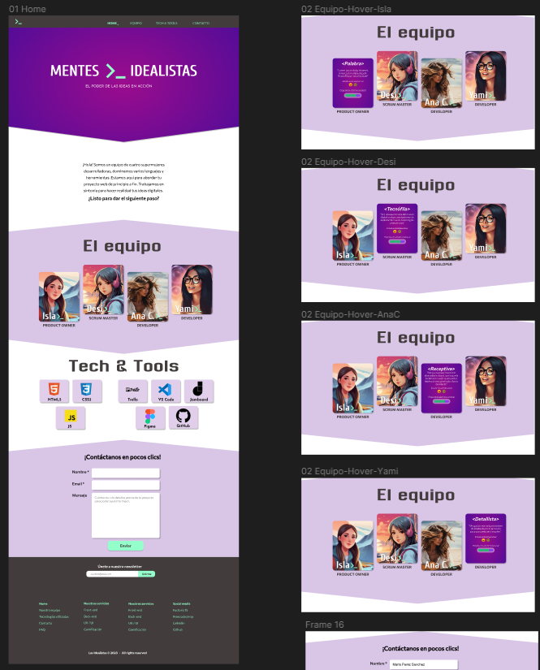

# P1-LasIdealistas
Proyecto Grupal de FemCoders! Landing Page de presentación del equipo.


## Equipo

- Product Owner (PO): [@Isla](https://github.com/islacrur)
- Scrum Master (SM): [@Desiree](https://github.com/DevDesiree)
- Desarrolladores (Dev):
  - [@Ana C](https://github.com/AnaCe-7)
  - [@Yamila](https://github.com/yamiranea)


## Mockup, Sketch y Prototipo

Se adjuntan imagenes

### Sketch


---

### Mockup


---

### Prototipo


---
---


## Guía de Instalación

1. Clona este repositorio en tu máquina local:

   ```bash
   git clone https://github.com/DevDesiree/P1-LasIdealistas.git
    ```

2. Abre el archivo index.html en tu navegador web.

3. ¡Listo! Puedes comenzar a explorar el proyecto.